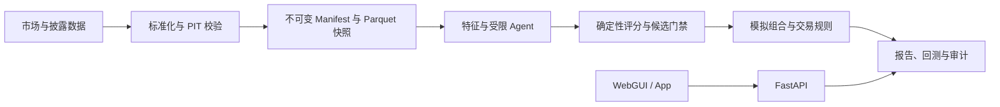

# A 股 AI 自动投研系统

[](https://github.com/dengrb1/ashare-ai-research/actions/workflows/build-and-publish.yml)
[](pyproject.toml)
[](LICENSE)

面向 A 股收盘后的研究、评分、模拟组合和事件驱动回测系统。它将市场数据、可审计的研究快照、确定性评分和模拟交易约束串成一条可复现的链路；**不连接自动实盘下单，也不构成投资建议**。

| 版本 | 运行方式 | Edge Gateway |
| --- | --- | --- |
| `v2.0.3` | Docker Compose、Windows 原生管理器、Linux 原生管理器 | `v2.0.4-alpha.1`，仅在 Docker x86_64 环境验证 |

## 目录

- [系统能力](#系统能力)
- [三分钟启动](#三分钟启动)
- [部署方式](#部署方式)
- [运行模型](#运行模型)
- [项目结构](#项目结构)
- [开发](#开发)
- [文档与 API](#文档与-api)
- [安全、数据与边界](#安全数据与边界)
- [许可证](#许可证)

## 系统能力

| 场景 | 提供的能力 | 关键边界 |
| --- | --- | --- |
| 收盘后研究 | 动态股票池、基本面/技术面/事件特征、AI 辅助解释、正式报告 | 数据必须满足 `available_at <= decision_at` |
| 评分与候选 | 版本化确定性综合评分、证据与质量门禁、候选过滤 | Agent 只输出经 Pydantic 校验的子分和证据 |
| 模拟组合 | 15 只目标持仓、单股/行业/换手/风险约束、熔断观察模式 | 只生成模拟方案，不发送真实订单 |
| 回测 | 事件驱动回测、成本与 A 股规则、基准和归因、复现哈希 | 只读取已提交的不可变研究快照 |
| 研究工作台 | WebGUI、行情与 K 线、个人自选/持仓、研究任务与报告 | 手工资产数据不覆盖版本化研究组合 |
| AI 问答 | 带证券 `@` 提及的持久化对话、PIT 上下文、可选检索 | 模型不获得数据库、凭据或任意内网访问权 |
| 退出与提醒 | 止损、盘中盈利退出、自选股入场区间和通知 | 只创建提醒、研究与模拟建议 |

### 可复现性是默认行为

系统的核心不是把行情展示在界面上，而是让每一次结论可以回放和审计：

- 研究、特征、评分、组合与回测统一以 `symbol + trading_date + available_at` 追踪，并冻结 `decision_at`。
- 原始载荷、Parquet 快照、模型产物与报告记录来源、抓取时间、版本和 SHA-256；DuckDB 仅查询显式提交的 Manifest。
- 综合评分来自版本化确定性公式：基本面 35%、技术面 35%、事件/情绪 20%、数据质量与置信度 10%。
- 涨跌停、T+1、费用、申报单位与新股规则来自带生效日期的规则数据；规则缺失、冲突或不匹配时不生成交易方案。
- 配置、运行输入、研究范围和资源档案均写入 Manifest 与审计记录。

## 三分钟启动

推荐先用源码 Docker Compose 运行完整栈。准备 Docker Desktop 或 Docker Engine 后，在仓库根目录执行：

```powershell
Copy-Item .env.local.example .env
Copy-Item .env.docker.example .env.docker
# 在未跟踪的 .env 中填写 ADMIN_PASSWORD、LLM_API_KEY 与 MODEL_SETTINGS_ENCRYPTION_KEYS
docker compose -p ashare-ai-src -f compose.yaml up -d --build
docker compose -p ashare-ai-src -f compose.yaml ps
```

默认栈不启动可选的 SearXNG，以节省常驻内存。需要联网检索时，在 `.env.docker`
设置 `SEARXNG_BASE_URL=http://searxng:8080`，并用
`docker compose -p ashare-ai-src -f compose.yaml --profile search up -d --build` 启动。

打开 [http://localhost](http://localhost)。首次启动需要在 `.env` 中设置管理员账号与强密码。服务健康后，可执行：

```powershell
docker compose -p ashare-ai-src -f compose.yaml exec api ashare-ai doctor
```

完整的服务器部署、HTTPS、备份、升级与故障排查见 [Docker 部署教程](docs/DOCKER_DEPLOY.md)。

## 部署方式

| 方式 | 适用场景 | 入口 |
| --- | --- | --- |
| 源码 Docker Compose | 开发、本机验收、可定制部署 | [三分钟启动](#三分钟启动) |
| GHCR Compose | 其他设备或服务器直接拉取完整部署集 | [GHCR 镜像部署](#ghcr-镜像部署) |
| Windows 原生管理器 | 不使用 Docker/WSL 的 Windows 环境 | [Windows 文档](docs/NATIVE_WINDOWS.md) |
| Linux 原生管理器 | 不使用 Docker 的 Linux 环境 | `linux/native-control-center/` |
| Edge Gateway Alpha | 可选 FRP/Nginx 边缘接入 | [Edge Gateway](#edge-gateway-alpha) |

### GHCR 镜像部署

GHCR 发布的是完整的 Compose 部署集，不是单一“全项目容器”。`compose.ghcr.yaml` 会使用以下自定义镜像：

- `ghcr.io/dengrb1/ashare-ai-research`：API 与 Worker
- `ghcr.io/dengrb1/ashare-ai-research-web`：WebGUI / Nginx
- `ghcr.io/dengrb1/ashare-ai-research-postgres`：PostgreSQL
- `ghcr.io/dengrb1/ashare-ai-research-edge-gateway`：可选 alpha 网关

Redis 与 SearXNG 仍由主 Compose 文件以固定 digest 启动。先将上述 GHCR Package 设为 Public，或先运行 `docker login ghcr.io`；随后：

```powershell
Copy-Item .env.production.example .env
Copy-Item .env.docker.example .env.docker
# 在 .env 中填写生产数据库、Redis、管理员密码和加密密钥
docker compose -p ashare-ai -f compose.yaml -f compose.ghcr.yaml pull
docker compose -p ashare-ai -f compose.yaml -f compose.ghcr.yaml up -d
docker compose -p ashare-ai -f compose.yaml -f compose.ghcr.yaml ps
```

Fork 部署时，可设置 `ASHARE_APP_IMAGE`、`ASHARE_WEB_IMAGE`、`ASHARE_POSTGRES_IMAGE` 和 `ASHARE_EDGE_GATEWAY_IMAGE` 指向自己的 GHCR 命名空间。

`latest` 与网关 `alpha` 是仅在 `main` 构建成功后更新的浮动标签。生产升级应将四个自定义镜像固定到同一成功构建产生的 `sha-<commit-short-sha>` 标签，以便回滚与复现。

### Edge Gateway Alpha

Edge Gateway 通过 Docker `edge` profile 启动，镜像标签为 `alpha`。它采用只读根文件系统、受限权限与可写日志挂载；当持久日志挂载不可用时自动写入容器临时目录，避免启动循环。

```powershell
docker compose -p ashare-ai -f compose.yaml -f compose.ghcr.yaml --profile edge up -d
```

网关仍处于 alpha，仅在 Docker x86_64 上完成验证。FRP TOML、结构化 Nginx 主机、校验、版本与回滚由受限控制器管理；敏感 `frpc.toml` 和生成的 `managed.conf` 不提交到仓库。

## 运行模型



| 层 | 职责 | 主要组件 |
| --- | --- | --- |
| 控制面 | 用户、配置、任务、审计与运行状态 | FastAPI、PostgreSQL、Redis |
| 数据面 | 数据接入、Manifest、不可变快照与对象产物 | Parquet、DuckDB、对象卷或外部 S3 |
| 研究面 | 特征、受限 Agent、确定性评分与预测分位 | Python、Pydantic、版本化配置 |
| 决策面 | 股票池、组合约束、A 股规则、事件回测 | 领域模型与规则数据 |
| 交互面 | WebGUI、原生管理器与移动端共用 API 契约 | React / Vite、Nginx、`/api/v1` |

默认 Docker 栈包括 WebGUI、API、串行 `job-worker`、独立 `exit-advice-worker`、PostgreSQL、Redis 和仅在私有网络中可访问的 SearXNG。小型主机建议至少 2 GB 内存。

API 默认使用 `LIGHTWEIGHT` 运行模式：实时行情不在 API 启动时预热 AKShare，缓存和预取并发受限，收盘后自动回收行情子进程与进程内缓存。长期进程还会在收盘、隔离任务完成或进入节能待机时，按 RSS 门槛和冷却时间执行 Python GC；Linux/glibc 环境同时尝试 `malloc_trim` 将空闲 arena 归还操作系统。可用 `MEMORY_RECLAIM_ENABLED`、`MEMORY_RECLAIM_MIN_RSS_MIB` 和 `MEMORY_RECLAIM_COOLDOWN_SECONDS` 调整，默认分别为 `true`、`160` 和 `300`。需要更高实时行情吞吐时，可通过 `/api/v1/admin/runtime/mode` 切换到 `SUPREME`；该模式仍把 AKShare 保持在隔离子进程中，不改变研究 Worker 的执行模式。

## 项目结构

```text
src/ashare_ai/
  core/            契约、配置、哈希、PIT 校验
  adapters/        行情、公告与供应商适配
  ingestion/       标准化、复权、披露校验、快照接入
  features/        基本面、技术面、情绪与质量特征
  agents/          结构化 Agent 与 Manager 边界
  scoring/          版本化确定性评分
  universe/         动态可交易池
  quant/            Qlib 数据集、滚动验证与预测分位
  trading/          A 股规则、费用、成交与 T+1
  portfolio/        组合约束、事件风险与熔断
  backtest/         事件驱动回测、基准、指标与复现哈希
  storage/          PostgreSQL、Parquet/DuckDB、对象存储
  reports/          可追溯日报与交易方案
  orchestration/    收盘后任务与 Worker
  api/              FastAPI 路由与共享 API 契约
native/ashare_ai_core/ 可选 Rust 技术指标 kernel（PyO3 facade）
web/                React + Vite 前端
docker/             应用、数据库与 Edge Gateway 镜像
windows/            Windows 原生管理器与安装包
linux/              Linux 原生管理器
docs/               API、部署、归档与发布说明
tests/              单元与集成测试
```

## 开发

### 依赖与本地服务

需要 Python 3.11、Node.js 20+。本地进程读取未跟踪的 `.env`；不要在模板或提交中保存密码、Token、Cookie 或 API Key。

```powershell
Copy-Item .env.local.example .env
python -m venv .venv
.\.venv\Scripts\python -m pip install ".[dev]"
docker compose -p ashare-ai-src -f compose.yaml up -d postgres redis
.\.venv\Scripts\ashare-ai doctor
.\.venv\Scripts\ashare-ai migrate
```

技术指标的 Rust kernel 是可选加速路径，不改变默认纯 Python 安装。需要本地启用时，先安装
`maturin`，再执行：

```powershell
maturin develop --manifest-path native/ashare_ai_core/Cargo.toml --features python
$env:ASHARE_NATIVE_TECHNICAL="on"
```

未安装扩展时默认 `auto` 会回退 Python；设置 `ASHARE_NATIVE_TECHNICAL=off` 可强制使用参考实现。

分别启动 API 与 Worker：

```powershell
.\.venv\Scripts\ashare-ai api
.\.venv\Scripts\python -m ashare_ai.orchestration.research_worker
.\.venv\Scripts\python -m ashare_ai.orchestration.backtest_worker
```

前端开发服务器会将 `/api` 代理到 `http://127.0.0.1:8000`：

```powershell
cd web
npm ci
npm run dev
```

访问 [http://localhost:5173](http://localhost:5173)。

### 检查

```powershell
.\.venv\Scripts\python -m pytest
.\.venv\Scripts\ruff check .
.\.venv\Scripts\mypy src
cd web
npm test -- --run
npm run build
```

`web/dist` 是有意提交的构建产物。改动 `web/src/` 或前端构建配置后，提交钩子会重建并暂存；手动构建时请一并检查 `web/dist` 的变更。

## 文档与 API

| 文档 | 内容 |
| --- | --- |
| [API 契约](docs/API.md) | `/api/v1` 路由、认证、状态码、分页与幂等要求 |
| [Docker 部署教程](docs/DOCKER_DEPLOY.md) | 服务器部署、HTTPS、GHCR、备份、升级与排错 |
| [Windows 原生管理器](docs/NATIVE_WINDOWS.md) | Windows 安装、启停、诊断与卸载 |
| [个人档案格式](docs/PERSONAL_ARCHIVE.md) | 加密导出、导入预览与合并边界 |
| [双研究 Worker](docs/DUAL_RESEARCH_CONCURRENCY.md) | `SERIAL` / `DUAL` 拓扑与容量约束 |
| [v2.0.3 发布说明](docs/releases/v2.0.3.zh-CN.md) | 当前稳定版本的变化与升级步骤 |
| [安全策略](SECURITY.md) | 漏洞报告与安全维护范围 |

Web 使用服务端会话、HttpOnly Cookie 和双提交 CSRF；原生 App 使用短期 Bearer access token 与轮换 refresh token。除健康检查和登录外，业务接口都需要认证。完整端点、请求体与兼容策略以 [API 契约](docs/API.md) 为准。

## 安全、数据与边界

- 生产环境必须设置 `COOKIE_SECURE=true`、实际域名的 `TRUSTED_HOSTS`、HTTPS 与模型网关主机白名单；API 在生产安全约束不满足时拒绝启动。
- PostgreSQL、Redis 和 API 默认仅绑定 `127.0.0.1`。正式部署应由受信任的 HTTPS 反向代理发布入口，绝不直接暴露数据库、Redis 或对象存储。
- `CANONICAL_BUNDLE_MODE=demo` 仅用于显式演示，且必须同时设置 `ALLOW_DEMO_DATA=true`。生产研究需要提供强类型 canonical bundle，缺失时安全终止。
- AKShare、Tushare、交易所与媒体数据均受各自的授权、服务条款和访问频率约束。重要公告应优先通过正式披露源核验。
- 系统仅面向研究、回测与模拟盘。所有结论都不承诺收益，任何交易决策由使用者自行承担。

## 许可证

本项目采用 [Apache License 2.0](LICENSE)。使用、修改或分发时请保留所要求的版权与许可证声明；第三方数据、模型、服务和依赖仍适用各自的许可与使用条款。
